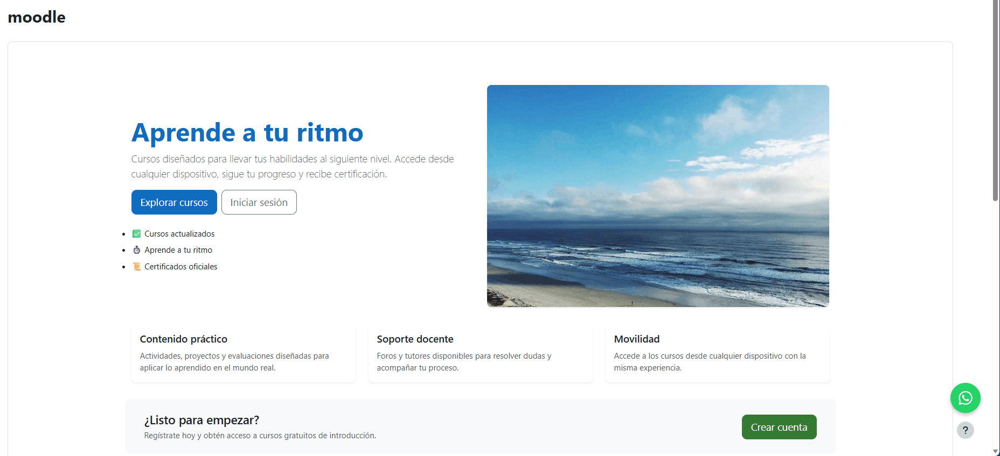
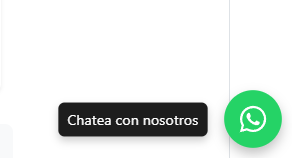

# Floating WhatsApp Button for Moodle

A simple, lightweight floating WhatsApp button for Moodle using only HTML and CSS.
No JavaScript required.

This solution allows users to contact you instantly via WhatsApp from anywhere on your Moodle site, improving communication and conversion.

---

## 🚀 Features

* Works globally across Moodle (using theme "Additional HTML")
* No JavaScript dependency
* Lightweight and fast
* Accessible (ARIA support included)
* Easy to customize
* Mobile-friendly

---

## 📸 Preview



---

## 📦 Project Structure

```
whatsapp-button-moodle/
│
├── index.html
├── styles.css
└── README.md
```

---

## 🛠️ Installation (Moodle)

1. Go to:
   **Site administration → Appearance → Additional HTML**

2. Add the HTML code in:

   * "Before BODY is closed"

3. Add the CSS code in:

   * Your theme custom CSS section
     *(or inside the same HTML block using `<style>`)*

4. Save changes and clear cache if needed.

---

## 💬 WhatsApp Link Format

Use the official WhatsApp Click-to-Chat format:

```
https://wa.me/<your-number>?text=<your-message>
```

### Example:

```
https://wa.me/573001234567?text=Hello,%20I%20would%20like%20information%20about%20your%20courses
```

---

## ♿ Accessibility

This implementation includes:

* `aria-label` for screen readers
* Hidden descriptive text (`sr-only` pattern)

---

## 🎯 Use Case

This component is ideal for:

* Online course platforms using Moodle
* Lead generation via WhatsApp
* Improving user support response time
* Increasing conversion from mobile users

---

## 📈 Next Step (Tracking Clicks)

To measure how many users click the button, you can integrate:

* Google Tag Manager
* Google Analytics (GA4)

👉 See the follow-up guide:
**"How to Track WhatsApp Button Clicks in Moodle with Google Tag Manager"**

---

## 🔗 Related Article

This project is based on the original tutorial:

👉 https://medium.com/@ingegus/cómo-crear-un-botón-flotante-de-whatsapp-en-moodle-72504d6d3b79

---

## 🧠 Notes

* This solution avoids JavaScript to keep performance high
* Works with most Moodle themes (Boost-based recommended)
* Positioning may require small adjustments depending on your layout

---

## 📄 License

Free to use and modify.

---

## 👨‍💻 Author

Created by Inge Gus
https://ingegus.dev

---
